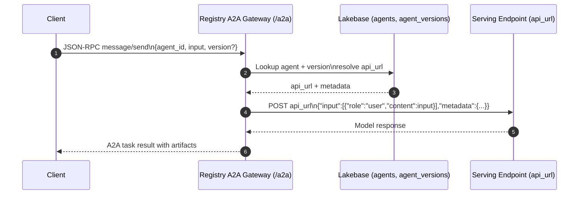
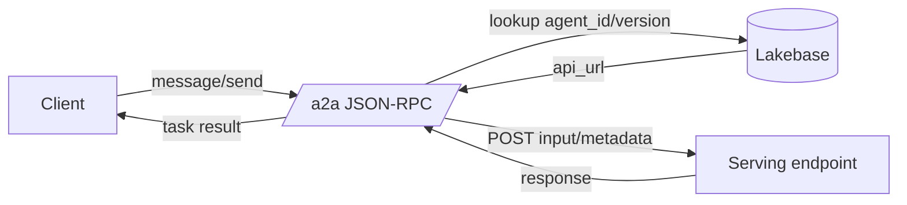
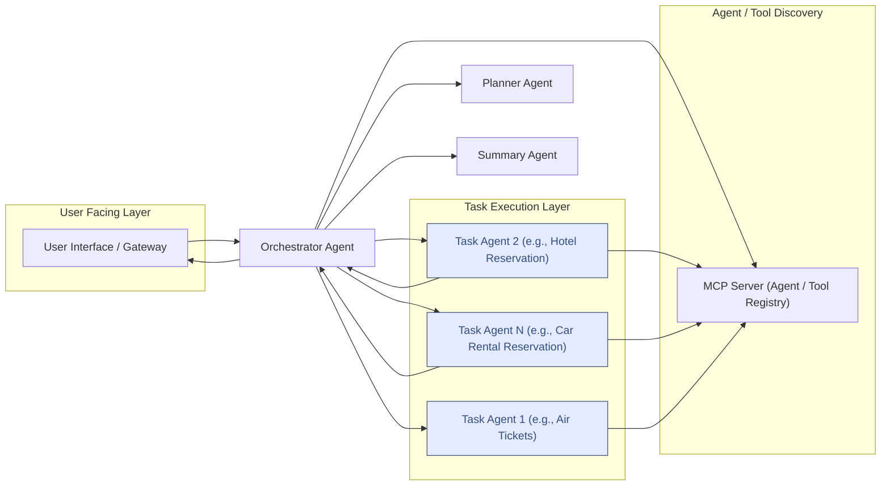

# Databricks Agent Interoperability Guide

Every week, we get asked by our customers what is the best way to communicate across the agent landscape, knowing that most cloud vendors are shipping MCP servers and agents as effective ways to interact with their platform. This blog tries to distill agent to agent communication and observability on Databricks, knowing that the space is in a constant state of evolution. We focus on the two leading protocols for agent communication - model context protocol (MCP) and agent2agent (A2A) and how they can be implemented on Databricks right now. 

Let’s Go!

## A Databricks First A2A Philosophy
Databricks already provides a robust hosted MCP environment, leading registry and catalog, and expansive serving platform. It allows you to build a simple agent registry that makes MCP-first agents trivial to publish, discover, and call, with optional A2A/A2A-style cards layered on top. 

The architectural philosophy focuses on:

- MCP-first: every agent is just an MCP server (often wrapping Unity Catalog tools or models), plus metadata. MCP is the primary integration surface in Databricks - every agent is built on or at least exposes MCP tools.

- UC as registry: Unity Catalog tables and models are the source of truth for agent metadata and versions.​ Unity Catalog gives you a governed registry for agents, similar to how A2A structures agent metadata but with first‑class data governance and lineage.

- Apps as control plane: a Databricks App provides the UI + APIs for CRUD on agents and discovery, with customizable agent discovery and APIs that evolve with A2A standards while preserving authentication. Apps + Serving make the entire stack one‑click deployable inside the customer’s workspace, so they don’t need to stand up separate infra to get a production‑grade agent registry.

- Serving as data plane: each agent is deployed to a Databricks serving endpoint; registry hands back the endpoint + contract. A2A‑style cards make your Databricks agents discoverable by external orchestrators (and vice versa) without forcing Databricks customers to understand all of A2A on day one.

## MCP and A2A in one stack

MCP is the tool/data integration layer; A2A is the agent-to-agent collaboration layer. In this architecture:

- MCP is the registry and discovery surface for agent cards and tools.
- A2A is the runtime protocol for sending tasks and receiving results.

The workflow looks like:

1) Agents register metadata in Lakebase (cards + versions).
2) MCP lists and returns those cards for discovery.
3) A2A uses the card to route requests to the agent runtime.

Here are the main components we use:

## Agent Registry via Unity Catalog

- agents table: logical agents (id, name, owner, status, default_version, etc.).
- agent_versions table: versioned metadata (version, UC model name, serving URL, MCP server URL, schema JSON, tags, protocols, security config).
- agent_protocol_cards table: optional A2A-style agent.json documents for cross-platform interoperability.

Versioning note: `agent_versions.version` is the registry version used for lookup and routing. A2A cards keep their own `agentVersion` for protocol semantics; the registry does not overwrite it unless missing.
The AgentCard is a protocol artifact while versioning and routing are registry concerns.

Add UC grants so platform teams control who can register and who can consume agents.

## MCP Server Hosting

Managed MCP servers backed by Unity Catalog functions and/or UC models, as already supported by Databricks.

## Agent Model Registry

MLflow + UC model registry entry per agent implementation (e.g. a LangGraph or Databricks Agents implementation)

## Agent Registry App

User interface with API endpoints that allow us to 
- List/search agents.
- Create/update agents.
- Generate and validate MCP tool specs and (optionally) A2A agent cards.
- Deploy/rollback serving endpoints.

## How do we manage state?

One of the most important components of agent interoperability is how you manage state between and within the agents. Databricks prefers to decouple this from the agent interoperability system (e.g. MCP or A2A) or the agents themselves and use a persistent database. We recommend Lakebase for this due to its ability to sync to open storage while providing low latency.

## Registry App APIs

The app exposes three surfaces: a registry HTTP API, an MCP resource endpoint, and an A2A JSON-RPC gateway. All paths are relative to the Databricks App base URL.

### Registry HTTP API

- `GET /registry/agents` → list agents.
- `GET /registry/agents/{agent_id}` → fetch a single agent.
- `GET /registry/agents/{agent_id}/versions` → list versions for an agent.
- `GET /registry/agents/{agent_id}/versions/{version}` → fetch a specific version.
- `GET /registry/agents/{agent_id}/card?version={version}` → fetch an A2A agent card JSON. If `version` is omitted, the default version is used.
- `POST /registry/register-agent-card` → register or update an A2A agent card.
- `GET /registry/status` → health summary for database, MCP, and A2A.

`/registry/api` mirrors the same endpoints, for example:

- `POST /registry/api/register-agent-card`

### MCP Registry

The MCP server is mounted at `POST /mcp` (streamable HTTP). It exposes A2A agent cards as MCP resources and a small toolset for discovery and invocation:

- `list_resources` → returns the `resource://agent_cards` index resource (`{"agents": [...agent_ids]}`).
- `list_resource_templates` → returns the `resource://agent_cards/{agent_id}` template for fetching individual cards.
- `read_resource(uri)` → returns the index JSON for `resource://agent_cards`, or the A2A card JSON for `resource://agent_cards/{agent_id}`.

Tools:

- `list_available_agents(tags?, skills?, limit?, include_full_card?, list_all_versions?)` → registered A2A agents, filterable by tags/skills.
- `invoke_agent(agent_id, task, timeout_seconds?)` → invoke a registered agent by id using a structured A2A task payload `{"goal": "...", "input": {...}, "metadata": {...}}`.

### A2A Gateway (JSON-RPC)

The A2A server is mounted at `/a2a` and uses the registry to route calls to MCP-first agents. The request payload must be JSON text sent as the user message.

#### A2A → Serving endpoint routing



1) Client sends `message/send` to `/a2a` with a JSON text payload containing `agent_id`, `input`, and optional `version`.
2) The gateway looks up the agent + version in Lakebase (`agents`, `agent_versions`) and resolves the `api_url` for that version.
3) The gateway forwards a Databricks model-serving style request to `api_url`:
   - `{"input": [{"role": "user", "content": "<input>"}], "metadata": {...}}`
4) The serving endpoint response is wrapped into the A2A task result and returned to the client.

Notes:
- The A2A AgentCard `url` points to `/a2a` (the JSON-RPC runtime), while the serving invocation URL is stored as `api_url` in `agent_versions`.
- If `api_url` is missing, the gateway returns a friendly error prompting you to register the endpoint.
- The gateway does not know about OpenAI directly; it only uses the `api_url`. If `api_url` points to a Databricks serving endpoint backed by OpenAI, the call routes there.



Supported gateway payloads:

- Call an agent:
  - `{"agent_id": "genie", "input": "List top 3 distribution centers.", "version": "1"}`
- List agents:
  - `{"action": "list_agents"}`

Example JSON-RPC request (message/send):

```
POST /a2a
{
  "jsonrpc": "2.0",
  "id": "req-1",
  "method": "message/send",
  "params": {
    "message": {
      "role": "user",
      "parts": [
        {
          "kind": "text",
          "text": "{\"agent_id\":\"genie\",\"input\":\"List top 3 distribution centers.\"}"
        }
      ]
    }
  }
}
```

## Auth and deployment notes

- Databricks Apps enforce OAuth Bearer auth on app routes. Use `WorkspaceClient().config.authenticate()` headers from notebooks or local code.
- Agent cards should use relative URLs when running behind the Databricks App reverse proxy.
- Streaming and push notifications are supported by A2A, but this registry gateway is currently non-streaming.
- Databricks Connect in this repo is configured for serverless compute; no classic cluster IDs are required.

## A2A + MCP client notes

- MCP discovery: `list_resources` returns `resource://agent_cards/<agent_id>`; `read_resource` returns the agent card JSON.
- A2A runtime: use JSON-RPC `message/send` with a text payload (see example above).
- For streaming, A2A uses SSE (`text/event-stream`). Enable streaming only if your executor supports it.

## Troubleshooting

- 302 redirects when fetching agent cards: ensure you are calling the app routes and sending a Bearer token.
- 401/403 on Model Serving: verify OAuth vs PAT compatibility and endpoint permissions.

## Walkthrough

Notebooks are numbered by flow:

- `notebooks/setup_registry.ipynb`: create Lakebase tables and seed the test agent.
- `notebooks/agent_registration_validation.ipynb`: register a Databricks agent card.
- `notebooks/test_agent_a2a.ipynb`: call the Test Agent and gateway via A2A.
- `notebooks/mcp_a2a_walkthrough.ipynb`: end-to-end MCP + A2A discovery and calls.

## Agent Dock sample

Agent Dock sits alongside Lakebase to give agents a place to land, discover each other, and exchange tasks. It uses MCP as the discovery surface and A2A for runtime communication.

### Objective

Use MCP to discover and retrieve A2A Agent Cards so orchestrators can route tasks to specialized agents.

### Core proposal

- Store A2A Agent Cards in a registry (file system, database, or vector store).
- Expose those cards via MCP resources (`list_resources` / `read_resource`).
- Use MCP tools to find the best agent for a task.
- Use A2A for the runtime interaction between agents.

### Architecture



### Example flow

1) User requests a trip plan.
2) Orchestrator looks up a Planner Agent card via MCP and invokes it.
3) For each task in the plan:
   - Use MCP tools to find a Task Agent card.
   - Invoke the Task Agent via A2A to execute the task.
4) Aggregate results and return a response.

### Steps to run the sample

```sh
bash agent_dock/run.sh
```

1) Start the MCP server:

   ```sh
   cd agent_dock
   uv venv # (if not already done)
   source .venv/bin/activate
   uv run --env-file .env mcp-agent-dock --run mcp-server --transport sse
   ```

2) Start the Orchestrator agent:

   ```bash
   cd agent_dock
   uv venv # (if not already done)
   source .venv/bin/activate
   uv run --env-file .env src/agent_dock/agents/ --agent-card agent_cards/orchestrator_agent.json --port 10101
   ```

3) Start the Planner agent:

   ```bash
   cd agent_dock
   uv venv # (if not already done)
   source .venv/bin/activate
   uv run --env-file .env src/agent_dock/agents/ --agent-card agent_cards/planner_agent.json --port 10102
   ```

4) Start the Airline Ticketing agent:

   ```bash
   cd agent_dock
   uv venv # (if not already done)
   source .venv/bin/activate
   uv run --env-file .env src/agent_dock/agents/ --agent-card agent_cards/air_ticketing_agent.json --port 10103
   ```

5) Start the Hotel Reservations agent:

   ```bash
   cd agent_dock
   uv venv # (if not already done)
   source .venv/bin/activate
   uv run --env-file .env src/agent_dock/agents/ --agent-card agent_cards/hotel_booking_agent.json --port 10104
   ```

6) Start the Car Rental Reservations agent:

   ```bash
   cd agent_dock
   uv venv # (if not already done)
   source .venv/bin/activate
   uv run --env-file .env src/agent_dock/agents/ --agent-card agent_cards/car_rental_agent.json --port 10105
   ```

7) Run the MCP client:

   ```bash
   cd agent_dock
   uv venv  # (if not already done)
   source .venv/bin/activate
   uv run --env-file .env src/agent_dock/mcp/client.py --resource "resource://agent_cards/list" --find_agent "I would like to plan a trip to France."
   ```

### Disclaimer

The sample code is for demonstration. Treat external agents as untrusted input and sanitize AgentCard fields, messages, artifacts, and task statuses before using them in prompts or workflows.

## Services and example agent

The app is organized by service:

- `src/registry_app/services/mcp_registry.py`: MCP server entrypoint
- `src/registry_app/services/a2a_executor.py`: A2A gateway
- `src/registry_app/services/http_api.py`: UI and registry HTTP API

Agents should be served separately from this app. Example cards live in `examples/agent_cards/`:

- `example_agent_card.json`: generic demo card.
- `test_agent_card.json`: local test agent card.
- `databricks_agent_card.json`: Databricks serving endpoint card.

For local testing, the app also exposes a Test Agent at `/test-agent` that returns a hello-world response with handshake details and keeps an in-memory history at `/test-agent/history`. Register it with the registry using `examples/agent_cards/test_agent_card.json` if you want to exercise the full MCP → A2A flow.

We run on Starlette + Uvicorn because the app primarily mounts MCP and A2A ASGI apps; keeping the host lightweight avoids extra framework layers while still providing straightforward routing for the registry UI and APIs.

## Configuration

The app reads a flat `config.yaml` file at the repo root. See `config.yaml` for the full set of keys.

Required (one of):

- `lakebase_dsn`: psycopg DSN for Lakebase (Postgres-compatible).
- `lakebase_host`: Lakebase DNS host (OAuth token from WorkspaceClient is used for auth).

Common optional keys:

- `lakebase_db` (default `databricks_postgres`): Lakebase database name.
- `lakebase_user`: override username when building OAuth DSN.
- `registry_schema` (default `agent_registry`): schema containing registry tables.
- `workspace_url`: Databricks workspace URL (used to derive registry base URL).

## Quickstart (local)

1) Create Lakebase tables and seed the test agent:

   ```sh
   uv run jupyter notebook notebooks/setup_registry.ipynb
   ```

2) Start the registry app:

   ```sh
   uv run uvicorn registry_app.server:app --host 0.0.0.0 --port 8000
   ```

3) Register or validate an agent card:

   ```sh
   uv run jupyter notebook notebooks/agent_registration_validation.ipynb
   ```

4) Call the A2A gateway or fetch well-known cards:

   ```sh
   uv run jupyter notebook notebooks/mcp_a2a_walkthrough.ipynb
   ```

## Local Run

```
uv run uvicorn registry_app.server:app --host 0.0.0.0 --port 8000
```

## Deployment (Databricks bundle)

`databricks.yml` is a one-shot bundle that provisions:

- A Lakebase Postgres instance (`database_instances.agent_registry`).
- The Databricks App `mcp-agent-dock`, bound to that database with `CAN_CONNECT_AND_CREATE` and granted `CAN_MANAGE` for the deploying user.

The app self-bootstraps its schema and seeds the local test agent on first start. A small `lakebase_setup` job grants the app's service principal access to the registry schema if it was created by another principal (e.g. an earlier notebook-based setup); on a fresh deploy it's a no-op and the app's bootstrap takes over.

Three-command deploy:

```sh
databricks bundle deploy -t dev -p DEFAULT
databricks bundle run lakebase_setup -t dev -p DEFAULT
databricks bundle run registry_app -t dev -p DEFAULT
```

The Lakebase host is resolved at runtime from `lakebase_instance_name`, so renames or recreates of the instance work without editing `config.yaml`.

## Registry UI

```
http://localhost:8000/registry/list
```

The UI shows database status, MCP/A2A endpoints, and lets you browse agent cards.
